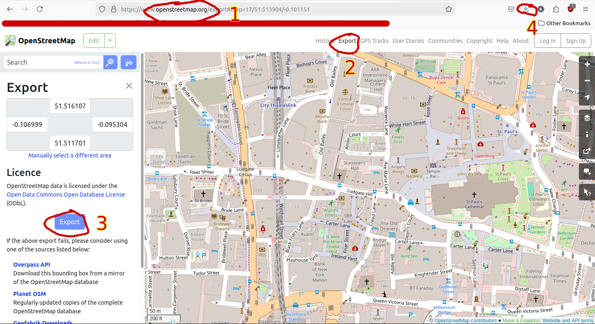

# Step 1: Install Mod

Install Luanti.

1. Download files from github repository and extract.
2. Go to 'About' tab in Luanti.
3. Click on 'Open User Data Directory'
4. Go to 'Mods' Folder.
5. Copy downloaded files into this folder.

# Step 2: Download Data

1. Go to openstreetmap.org and navigate to your area of interest.
2. Click export button
3. Check area is correct and click other export button
4. Check Downloads for 'map.osm' file.

[]

# Step 3: Insert Data to world

1. Create **new** Luanti world in Minetest Game
2. Ensure that the world type is **singlenode**.
3. Click on select mods tab and add the mod generateosm.
4. Open world initially and leave. (Also you can give yourself commands like fly,fast,teleport)

5. Go to 'About' tab in Luanti.
6. Click on 'Open User Data Directory'
7. Go to 'Worlds' Folder.
8. Open folder that corresponds to your world name.
9. Drag downloaded 'map.osm 'to this folder. 

# Step 4: Generate world

1. Enter the Luanti world again.
2. Type '/generate map.osm'. Change the file name if you have renamed it.